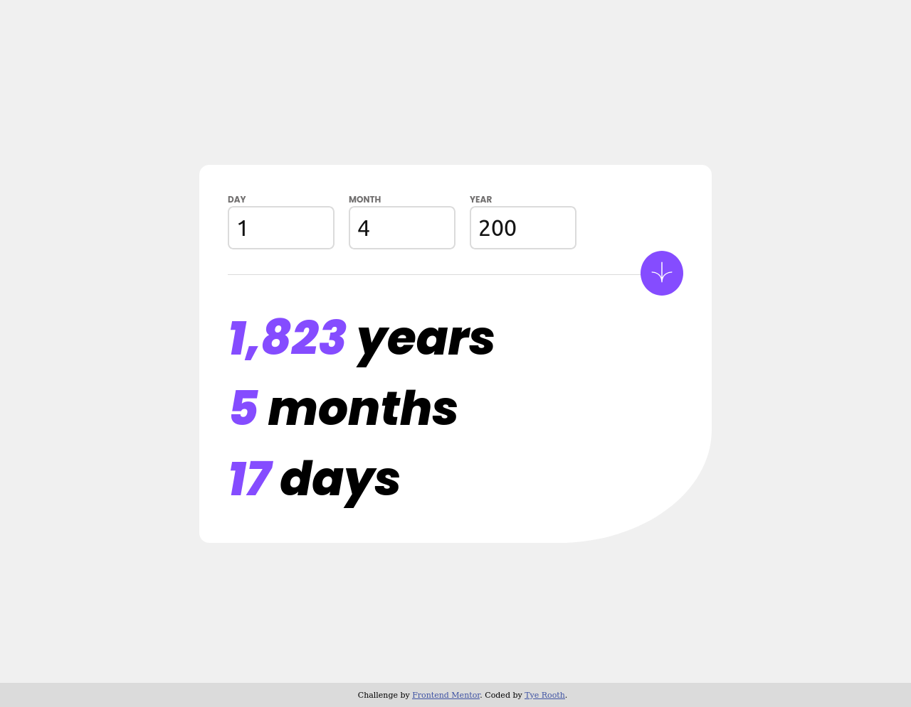

# Frontend Mentor - Age calculator app solution

This is a solution to the [Age calculator app challenge on Frontend Mentor](https://www.frontendmentor.io/challenges/age-calculator-app-dF9DFFpj-Q). Frontend Mentor challenges help you improve your coding skills by building realistic projects. 

## Table of contents

- [Overview](#overview)
  - [The challenge](#the-challenge)
  - [Screenshot](#screenshot)
  - [Links](#links)
- [My process](#my-process)
  - [Built with](#built-with)
  - [What I learned](#what-i-learned)
  - [Continued development](#continued-development)
- [Author](#author)

## Overview

### The challenge

Users should be able to:

- View an age in years, months, and days after submitting a valid date through the form
- Receive validation errors if:
  - Any field is empty when the form is submitted
  - The day number is not between 1-31
  - The month number is not between 1-12
  - The year is in the future
  - The date is invalid e.g. 31/04/1991 (there are 30 days in April)
- View the optimal layout for the interface depending on their device's screen size
- See hover and focus states for all interactive elements on the page
- **Bonus**: See the age numbers animate to their final number when the form is submitted

### Screenshot

### Links

- Live Site URL: [Github Pages Link](https://tyerooth.github.io/fe-mentor-age-calculator/)

## My process

1. Build out the structures of all the required React components.
2. Tested state controlled components using hard coded values.
3. Added PropType validations to all of the components.
4. Added state control to components.  Did not add validation to form yet.
5. Styled components in order of top-bottom as seen on page.
6. Added Date validation for the form.
7. Styled error handling on Form.
8. Added functions for calculating the age last.
9. Animated the number increases using CountUp. (Flourish).

### Built with

- Semantic HTML5 markup
- CSS custom properties
- Flexbox
- [React](https://reactjs.org/) - JS library
- [Vite](https://vitejs.dev/) - React build tool
- [Styled Components](https://styled-components.com/) - For styles

### What I learned

#### Styled Components

This is my first project using the Styled Components library.  In the FormItem component, I successfully used the <i>error</i> prop to change the styling for the form item depending on whether there was an error.  The way Styled Components uses template literals for adding the styling to components is clever.  When I was building projects using vanilla Javascript plus CSS and HTML, I tried experimenting with dynamically changing the styles of an element based on a JavaScript function.  I don't remember my exact thought process at the time, but I was unable to achieve a reliable way to dynamically write styles in JavaScript.  Styled components is a solution to the problem I was looking into at the time specifically for React applications.  I also used the GlobalStyles API for font size and families.

#### Luxon and Date Validations

I experienced an unexpected bug with the form validation once I had technically finished all the main parts of the project.  If I submitted a year that was less than 100, funky things would happen with form validation.  I figured out that JavaScript date objects have built-in ways of interpreting dates that are supposed to make handling Dates easier.  I did not realize that setting the year below 100 would automatically change the year to between 1950 and 2050.  Things got even funkier once I was below year 10 as the month, day, and year values being entered into the Date object completely switched.  I was unaware of this until I console logged the Date object upon these invalid form submission.  I asked ChatGPT what libraries are useful for dealing with these Date inconsistencies and it suggested Moment.js or Luxon.  I checked out Moment first and saw that the library was abandoned, so I checked out and implemented Luxon.  With Luxon, managing Dates was much easier and their documentation was relatively strong.

#### Validating props with PropTypes

This is the first project where I validated the props being passed into Components.  I used the PropTypes object to do this as I have yet to learn TypeScript from the online course I am taking.  An interesting aspect of using jsx files rather than js files like I have used in previous projects is the linter would point out that I wasn't validating PropTypes and would direct me to do this.  I think this would have been extremely useful for past projects, so I would understand how and why proptype validation is important to add.  At one point, I went on a detour trying to figure out how to set a PropType to accept either a string or null.  I eventually figured out that is what the isRequired method can cover.

#### Countup library

I used the CountUp library for the first time to animate the calculation numbers.  Efficient and to the point.

#### Vite

This is the first React app I initialized using Vite rather than with create-react-app.  I will never be going back to create-react-app.  There was less work to do in the beginning and don't even get me started on how much easier deploying a Vite React project is.

Use this section to recap over some of your major learnings while working through this project. Writing these out and providing code samples of areas you want to highlight is a great way to reinforce your own knowledge.

### Continued development

#### Styled Components

Having the styling for a component be in the same module as the Components build and functions is useful for organizing the project's code.  This raised a few best practice questions I have though.  Styled components also allows devs to add styling to custom components.  If I use that option, the styling for a child component will technically be in the parent module which reduces the code organization of the project.  Am I right in thinking that I should be consistent in choosing styling of custom components vs styling of elements which are then put in the component? I am thinking a great next step for figuring this out will be asking for feedback from someone more familiar with the Styled Components library.  The global styles do not work on my live Github page indicating I need to investigate this function more.  In summary, I want to figure out whether there is a better way to organize Styled Components code.

#### Other future focuses

I took on this challenge in order to practice my styling skills using a new tool, Styled Components.  Although, the final product has the styling I want, I needed to spend some time researching the best way to make flexbox responsive for mobile devices again.  I am still working through my full-stack course, but once that is done, I may look into a responsive design course since I want those practices to be ingrained in my projects rather than an effort to maintain.

## Author

- Website - [Tye Rooth](https://tyerooth.github.io/personal-portfolio/)
- LinkedIn - [LinkedIn](https://www.linkedin.com/in/tyerooth)
